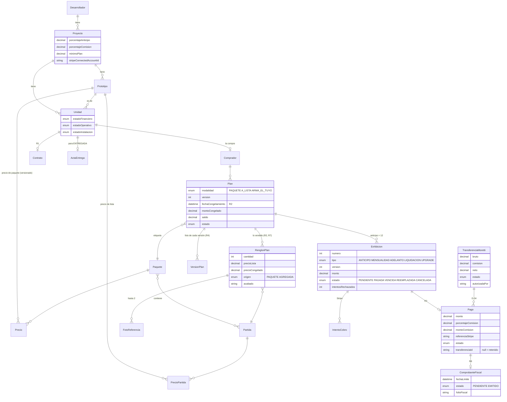
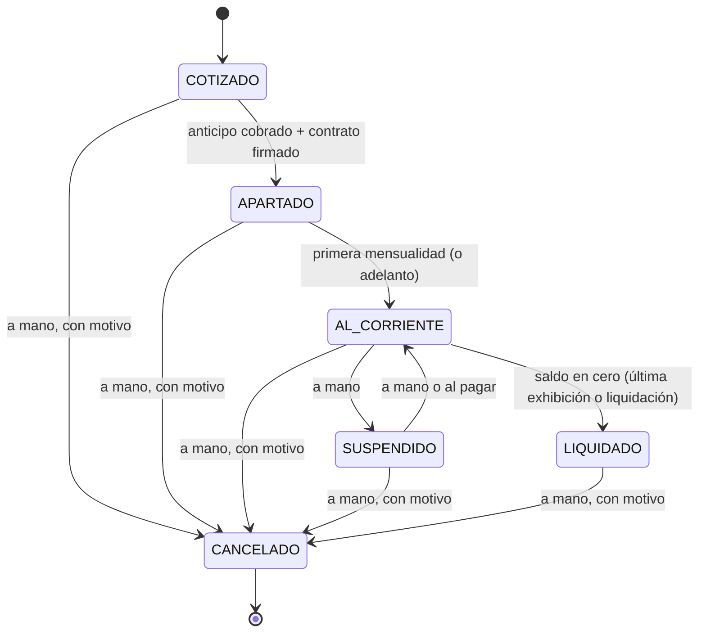
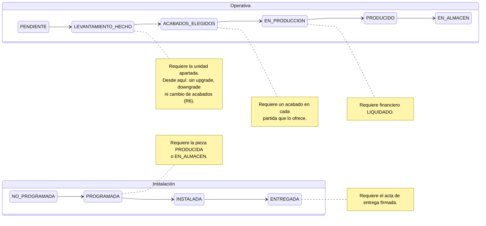
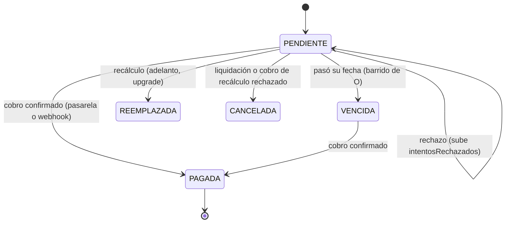

# Diagramas: modelo de datos y máquinas de estado

Actividad X+Y del Sprint 3 (parte de Ethan). Los diagramas están en Mermaid:
GitHub y VS Code los dibujan solos. Fuente de verdad: `prisma/schema.prisma`
y `lib/motor/estados.ts` y `lib/motor/operacion.ts`.

## 1. Modelo de datos

Sólo las columnas que explican el diseño; el esquema completo está en
`prisma/schema.prisma` y el detalle en `modelo-de-datos.md`.



**Invariantes que el motor verifica** (y sus pruebas):

| Invariante | Dónde |
|---|---|
| Σ `RenglonPlan.precioCongelado` = `Plan.montoCongelado` (R7) | alta, upgrade |
| Σ exhibiciones vigentes = `Plan.montoCongelado` (R7) | alta, cada versión nueva |
| Un `Pago` por exhibición; un pago no se edita ni se borra (R3) | índice único, `aplicarPago` |
| Un `ComprobanteFiscal` por pago, creado en la misma transacción (R8) | `crearPendienteFiscal` |
| Un pago sólo en una transferencia | reserva condicionada en `autorizarTransferencia` |
| La bitácora `Evento` sólo crece | nadie la actualiza ni la borra |

## 2. Máquina financiera de la unidad

Las flechas gruesas las provoca un cobro; las punteadas son manuales desde el
back office (`cambiarEstadoFinanciero`). Cancelar exige motivo y es definitivo.



## 3. Máquinas operativa e instalación, con las reglas cruzadas

Las dos avanzan de un paso en uno y no retroceden. Las notas son las reglas
que las cruzan con la financiera (actividad Q, `lib/motor/operacion.ts`).



**Candado financiero:** con la unidad **SUSPENDIDA** o **CANCELADA**, ninguna
de las dos avanza (tampoco retrocede); al reactivarse sigue donde iba.

## 4. Una exhibición



## 5. Un cobro, de punta a punta

```mermaid
sequenceDiagram
  participant BO as Back office / sitio
  participant M as Motor
  participant P as Pasarela (Stripe)
  participant DB as Base
  BO->>M: cobrarExhibicion(id)
  M->>M: reglas (R1 contrato, vigente, no pagada)
  M->>P: cobrar(llave plan:exh:intento, centavos, comisión)
  alt exitoso
    P-->>M: referencia
    M->>DB: Pago + exhibición PAGADA + saldo + estado (máquina) + comprobante fiscal + evento
  else pendiente (3-D Secure)
    P-->>M: pendiente
    M->>DB: evento; el webhook aplica después
  else rechazado
    P-->>M: código
    M->>DB: intentosRechazados+1 + evento (siguiente intento, llave nueva)
  end
  Note over DB: El dinero queda retenido en la plataforma (D-34)<br/>hasta que Ana Cris autoriza la transferencia a Moretti.
```
